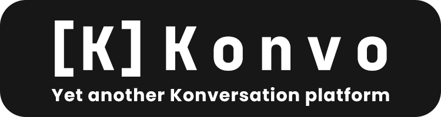

       

⭐ Star this repo on GitHub to support the project and stay updated with the latest changes.

[](https://twitter.com/intent/tweet?text=Check%20out%20this%20awesome%20real-time%20chat%20application%20called%20Konvo!&url=https%3A%2F%2Fgithub.com%2FShaeikh%2FKonvo&hashtags=Konvo,ChatApp,RealTimeChat,NextJS,NodeJS,Express,SocketIO)
[](https://www.linkedin.com/sharing/share-offsite/?url=https%3A%2F%2Fgithub.com%2FShaeikh%2FKonvo)
[](https://www.facebook.com/sharer/sharer.php?u=https%3A%2F%2Fgithub.com%2FShaeikh%2FKonvo)
[](https://www.reddit.com/submit?url=https%3A%2F%2Fgithub.com%2FShaeikh%2FKonvo&title=Check%20out%20this%20awesome%20real-time%20chat%20application%20called%20Konvo!)

##### Konvo is a real-time chat application built with Next, Node.js, Express, and Socket.io. It allows users to communicate with each other in real-time through a web interface.

### Table of Content

- [Features](#features)
- [Built with](#built-with)
  - [Frontend](#frontend)
  - [Backend](#backend)
  - [Database](#database)
  - [Auth](#auth)
- [Before you start](#before-you-start)
- [Getting started](#getting-started)
  - [Clone the repo](#clone-the-repo)
  - [Install packages](#install-packages)
  - [Set up the env file](#set-up-the-env-file)
- [Env variables](#env-variables)
- [Run it](#run-it)
  - [Dev mode](#dev-mode)
  - [Prod mode](#prod-mode)
- [Want to help out?](#want-to-help-out)
- [License](#license)
- [Thanks](#thanks)

## Features

- Real-time chat with Socket.io
- Sign up and log in with Better Auth
- Chat rooms you can join and switch between
- Dark and light mode
- Works on desktop and mobile

## Built with

### Frontend

- [Next.js](https://nextjs.org) (App Router)
- [React](https://react.dev)
- [Tailwind CSS](https://tailwindcss.com)
- [shadcn/ui](https://ui.shadcn.com) components
- [Framer Motion](https://www.framer.com/motion/) for animations

### Backend

- [Node.js](https://nodejs.org)
- [Express](https://expressjs.com)
- [TypeScript](https://www.typescriptlang.org)

### Database

- [PostgreSQL](https://www.postgresql.org)

### Auth

- [Better Auth](https://better-auth.com) for sign up, log in and sessions

## Before you start

Make sure you have these installed:

- [Node.js](https://nodejs.org) (v18 or newer)
- [npm](https://www.npmjs.com) (comes with Node)
- A [PostgreSQL](https://www.postgresql.org/download/) database running somewhere (local or hosted)

## Getting started

### Clone the repo

```bash
git clone https://github.com/Shaeikh/Konvo.git
cd Konvo
```

### Install packages

```bash
npm install
```

### Set up the env file

Copy the example file and fill in your own values:

```bash
cp .env.example .env
```

## Env variables

| Variable                 | What it's for                                                                                         |
| ------------------------ | ----------------------------------------------------------------------------------------------------- |
| `BETTER_AUTH_SECRET`     | Secret key used by Better Auth. See the [Better Auth docs](https://better-auth.com/docs/installation) |
| `BETTER_AUTH_URL`        | The base URL of the app, e.g.`http://localhost:3000`                                                  |
| `POSTGRESQL_URL`         | Your Postgres connection string                                                                       |
| `NEXT_PUBLIC_APP_URL`    | The app URL used in production                                                                        |
| `NEXT_PUBLIC_SOCKET_URL` | Optional. Where the socket server runs. Left empty, it uses the base URL                              |

## Run it

### Dev mode

```bash
npm run dev
```

Open [http://localhost:3000](http://localhost:3000) in your browser.

### Prod mode

```bash
npm run build
npm start
```

## Want to help out?

Contributions are welcome! Here's how:

1. Fork the repo
2. Make a new branch (`git checkout -b my-feature`)
3. Commit your changes (`git commit -m "Add my feature"`)
4. Push the branch (`git push origin my-feature`)
5. Open a pull request

Found a bug? Feel free to [open an issue](https://github.com/Shaeikh/Konvo/issues).

## License

This project is licensed under the MIT License. See the [LICENSE](LICENSE) file for more info.

## Thanks

- [Next.js](https://nextjs.org) for the framework.
- [Better Auth](https://better-auth.com) for easy authentication
- [Socket.io](https://socket.io) for real-time messaging
- [shadcn/ui](https://ui.shadcn.com) for the UI components
- Everyone who stars and shares the project ⭐
- Me who is brave enough to use Socket.io with Next
